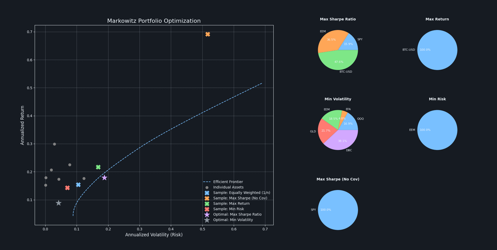

# Markowitz Portfolio Optimizer


A command-line Python application that implements Harry Markowitz's Modern Portfolio Theory (MPT). This tool fetches historical market data for a basket of assets and runs portfolio optimization to find the **Efficient Frontier**.

It generates a "dashboard-style" plot showing the risk/return profile of all assets, the optimal frontier, and the composition of key portfolios as pie charts.



## Why Is This Project Useful?

This project is not just a calculation; it is a visual proof of *why* diversification is considered the "only free lunch in finance."

The main goal is to **visually compare** a mathematically optimized portfolio against common-sense "naive" strategies. By plotting the optimized portfolios (stars) against the naive portfolios (X's), the chart demonstrates that the optimized portfolios provide a superior risk-adjusted return.

The key analytical feature is the **"Naive Max Sharpe (No Cov)"** portfolio. This is an optimizer built to be *intentionally wrong*—it is blind to correlation. By plotting its "optimal" choice on the chart, we can see how badly it performs in reality, providing a powerful validation for the Markowitz model.

## Key Features

* **Flexible CLI:** Analyze up to 20 assets and custom date ranges directly from the command line.
* **Efficient Frontier Calculation:** Implements `scipy.optimize` to find the set of all optimal portfolios.
* **Optimal Portfolio Identification:** Pinpoints two key portfolios:
    * **Max Sharpe Ratio:** The "best" portfolio for its risk.
    * **Min Volatility:** The safest (least volatile) portfolio possible.
* **Naive Strategy Comparison:** Builds and plots four "naive" portfolios for comparison:
    * **Max Return (100%):** The asset with the highest historical return.
    * **Min Risk (100%):** The asset with the lowest individual volatility.
    * **Equally Weighted (1/n):** A simple, diversified strategy.
    * **Max Sharpe (No Cov):** A custom-built "naive" optimizer that ignores correlation (see explanation below).
* **Visual Composition:** Automatically generates pie charts for the composition of all key portfolios.
* **Modern Styling:** Uses `matplotx.styles.github["dark"]` for a clean, professional visualization.

## Core Concepts & Formulas Explained

This project is built on a stack of core financial and statistical formulas.

### 1. Logarithmic Returns
Instead of simple percentage change, we use logarithmic returns.
**Formula:** $R_{log} = \ln(\frac{P_t}{P_{t-1}})$
**Utility:** Log returns are time-additive, meaning the total return over $n$ days is simply the *sum* of the daily log returns. This makes all subsequent statistical calculations (like mean and variance) more robust.
**Code:** `np.log(prices / prices.shift(1))`

### 2. Annualized Inputs
Daily data is too "noisy" for high-level analysis. We annualize the mean and covariance by multiplying by the number of trading days (252).
* **Annualized Mean Return:** $E(R_{\text{ann}}) = E(R_{\text{daily}}) \cdot 252$
* **Annualized Covariance:** $\Sigma_{\text{ann}} = \Sigma_{\text{daily}} \cdot 252$
**Code:** `log_returns.mean() * trading_days` and `log_returns.cov() * trading_days`

### 3. Portfolio Return
The expected return of a portfolio is the weighted average of the expected returns of its individual assets.
**Formula:** $E(R_p) = w^T \cdot E(R)$
* $w^T$: The transpose of the weights vector (e.g., `[0.2, 0.5, 0.3]`).
* $E(R)$: The vector of expected mean returns for each asset.
**Code:** `np.dot(weights.T, mean_returns_arr)`

### 4. Portfolio Volatility (The "Markowitz Risk")
This is the **most important formula** in the project. It calculates the *true* risk (volatility) of the entire portfolio by using the covariance matrix.
**Formula:** $\sigma_p = \sqrt{w^T \cdot \Sigma \cdot w}$
* $w^T$: The weights vector.
* $\Sigma$: The **Covariance Matrix**, which accounts for how each asset correlates with every other asset.
* $w$: The weights vector.
**Utility:** This formula correctly captures the risk-reducing effects of diversification. If two assets have a negative covariance, this formula results in a *lower* total portfolio risk.
**Code:** `np.sqrt(np.dot(weights.T, np.dot(cov_matrix_arr, weights)))`

### 5. The Sharpe Ratio (Markowitz)
This measures the **quality** of a return (the "risk-adjusted return"). A higher Sharpe Ratio is better.
**Formula:** $S_p = \frac{E(R_p) - R_f}{\sigma_p}$
* $R_p$: The portfolio's return (Formula 3).
* $R_f$: The Risk-Free Rate (e.g., a T-Bill, set to 2% in this project).
* $\sigma_p$: The portfolio's *true* volatility (Formula 4).
**Code:** `(portfolio_return - risk_free_rate) / portfolio_volatility`

### 6. The "Naive Sharpe (No Cov)" Concept
This is the custom-built "competitor" portfolio, designed to be logically flawed.
**Hypothesis:** What if an optimizer *thinks* risk is just the weighted average of individual asset risks? This optimizer is blind to the covariance matrix and assumes all correlations are zero.
**"Naive Risk" Formula:** $\sigma_{\text{naive}} = w^T \cdot \sigma_{\text{ind}}$
* $w^T$: The weights vector.
* $\sigma_{\text{ind}}$: A vector of *only* the individual volatilities of each asset (the diagonal of the covariance matrix).
**Code (Naive Sharpe):** `(portfolio_return - risk_free_rate) / naive_volatility`
**The "Reality Check":**
1.  The `find_max_naive_sharpe_portfolio` function finds the "best" weights (e.g., 100% in `SPY`) based on this *flawed formula*.
2.  Then, in `main.py`, we take those flawed weights and plot them on the chart using their **TRUE risk** (calculated with the *correct* Markowitz formula).
3.  **The Result:** This "Naive" portfolio (plotted as an 'X') appears *inside* the Efficient Frontier, visually proving that ignoring covariance leads to a sub-optimal portfolio.

## Project Structure

```ascii
markowitz_optimizer/
│
├──  portfolio_optimizer/
│   ├── __init__.py
│   ├── data.py         # Fetches data, calculates returns and inputs
│   ├── model.py        # Core math: portfolio_stats, sharpe_ratio
│   ├── optimization.py # SciPy logic for finding optimal portfolios
│   └── plots.py        # Visualization logic (pies and scatter)
│
├── main.py             # Main entry point with CLI argument parsing
├── requirements.txt    # Project dependencies
└── README.md
```
## Installation & Usage
Clone the repository:

```Bash

git clone [https://github.com/lucasribeirocaetano/markowitz-portfolio-optimizer.git](https://github.com/lucasribeirocaetano/markowitz-portfolio-optimizer.git)
cd markowitz-portfolio-optimizer
```

Install the dependencies: (This requirements.txt is the minimal set required for the project.)

```Bash
pip install -r requirements.txt
```

To run with default assets (10 ETFs):

```Bash
python main.py
```

To analyze a custom list of tickers (up to 20):

```Bash
python main.py -t AAPL MSFT GOOG TSLA
```

To specify a different time frame:

```Bash
python main.py -t SPY GLD TLT -s 2010-01-01 -e 2023-12-31
```
To see all options:

```Bash
python main.py --help
```